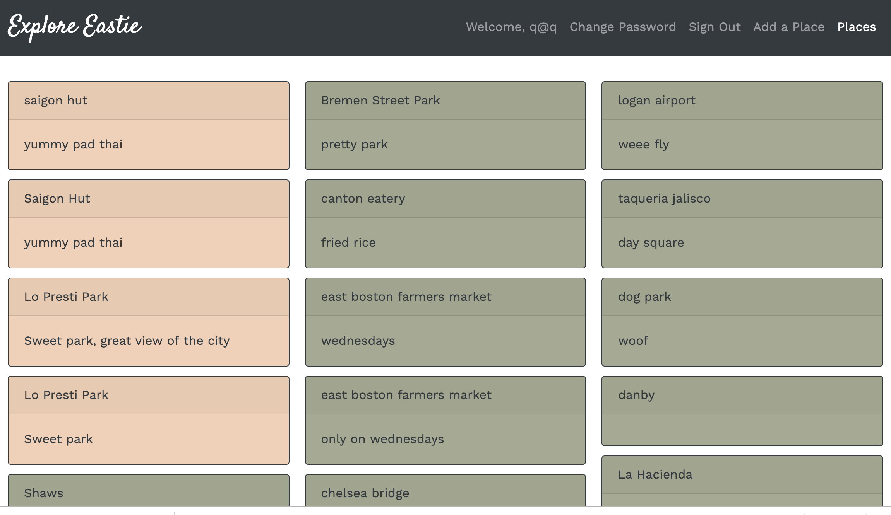

## Let's Explore Eastie! ##

Welcome to my app.  If you're here, you're probably either wondering where all the great spots are in East Boston or you want to share your knowledge about them with others.  Explore Eastie is a place to share and find hidden gems in the neighborhood.  It's perfect for locals and travelers alike.  Simply create an account to browse places, learn about them, and see the location.  You can also create new places and share what you like or dislike about them.

### User Stories ###

- As a user I want to view all the places
- As a user I want to view one place
- As a user I want to create a place
- As a user I want to update or delete a place I own
- As a user I want to see a map associated with every place that has a legitimate address

### Mobile Wireframes: ###

### Desktop Wireframes: ###

### Links: ###

[Back End Repository](https://github.com/drekaygran/explore-api)

[Front End Deployed App](https://drekaygran.github.io/explore-eastie/#/)

[Back End Deployed Site](https://aqueous-spire-50426.herokuapp.com/)

### Technologies used: ###
- React
- Google Maps API/Geocoder
- HTML/CSS
- Javascript
- Ruby on Rails
- Heroku
- Axios
- Bootstrap

### Unsolved Problems: ###
- Insert Marker on Map
- Allow for user to request directions to location
- Allow users to contribute to same place rather than only creating new ones
- Allow for comments and photos to be added to a place

### Strategy and Planning: ###
I started this project with the goal to complete CRUDing the places resource. Once I had that completed, I did the same for the addresses resource. I knew if I could get both then completed, I'd be able to get started using the Google Maps Api.  It was definitely challenging to learn how the Google Map and the Geocoder API work, but it was so worth the effort because I think the map really makes this app more interesting and useful.  When I encountered problems, I did some research and combed through my code, but I've learned to be quick to ask for help and then continue working.  That way, I'm not starting to ask for help when I'm completely out of energy.

### Set Up Instructions ###

If you'd like your own version of this project follow these steps.
- Fork and clone this repository.
- Create a new branch, for your work.
- Checkout to the new branch.
- Install dependencies with npm install.

